# Killport

<div align="center">


&nbsp;&nbsp;


### Kill the process on any port — and know exactly what you're hitting.

No more `netstat -ano | findstr :3000` followed by guessing what PID 18244 even is.
Killport tells you it's `next-app` running via `npm run dev`, and lets you kill or
restart it in one click — or one command.

[](https://github.com/episuarez/killport/actions)
[](https://github.com/episuarez/killport/releases)
[](LICENSE)
[](https://github.com/episuarez/killport/releases)
[](https://www.rust-lang.org)
<br>
[](https://github.com/episuarez/killport/releases)
[](https://github.com/episuarez/killport/commits/main)
[](https://github.com/episuarez/killport/issues)
[](CONTRIBUTING.md)

</div>

---

## Install

Download the latest `.exe` installer or `.msi` package from the [Releases](https://github.com/episuarez/killport/releases) page.

Requires **Windows 10 version 1803** or later (WebView2 runtime, included with Windows since 2018).

---

## Why Killport

Every dev day starts the same way: `EADDRINUSE`, a frozen dev server from yesterday,
a Docker container that never shut down. The fix is always the same three steps —
find the PID, figure out what it actually is so you don't kill the wrong thing,
then kill it — and Windows makes every one of those steps painful.

Killport collapses all three into one:

- **No more `netstat` + `tasklist` + `taskkill` combos.** One scan shows every
  listening port with the process, app, framework, and project behind it.
- **No more guessing if it's safe to kill.** A hard-coded guard list refuses to
  touch `lsass.exe`, `svchost.exe`, `services.exe` and friends — even by accident,
  even with `--force`.
- **No more stale ports after a kill.** `kill_tree` walks the whole process tree
  (`npm` → `node`, `docker-compose` → containers) so the port is actually freed,
  not just the parent.
- **No more retyping the start command.** Restart respawns the exact original
  command line in the original working directory.

---

## See it in action

<div align="center">

</div>

```
$ killport list
PORT   PID    KIND   APP        ORIGIN
3000   18244  node   next-app   npm run dev
5432   9001   pgsql  postgres   service: postgresql-x64-16

$ killport kill 3000
killed 1 process(es) in tree of pid 18244
```

<div align="center">

</div>

---

## What it does

| Feature | Details |
|---|---|
| **Port scan** | All listening TCP ports, IPv4 + IPv6, via Win32 IP Helper API — no `netstat` |
| **Process context** | Runtime (Node, Python, PHP, Go, PostgreSQL, Redis, Docker…) + detected framework (Vite, Next.js, Django, Laravel…) + project name |
| **Docker-aware** | Maps container ports to their image and name |
| **Windows services** | Identifies SCM-registered services |
| **System guard** | Hard-coded protected-process list — critical OS processes can never be killed, even by mistake |
| **Kill** | Graceful (WM\_CLOSE → wait → force) or immediate; kills entire process trees so the port is actually freed |
| **Restart** | Kills and respawns with the original command line and working directory |
| **System tray** | Popup port list, notifications on port open/close, reserved-port alerts |
| **Dashboard** | Protocol probe (HTTP/WS/Redis/MySQL/gRPC…), firewall rule check, QR code for mobile access |
| **CLI** | Headless `killport` binary for scripting and automation |

---

## CLI usage

```
killport list                  # dev ports only
killport list --all            # include system processes
killport kill <port>           # graceful kill
killport kill <port> --force   # immediate kill
killport kill --pid <pid>      # kill by PID
killport restart <port>        # kill + respawn
```

---

## Build from source

```bat
rustup update stable
cargo install tauri-cli

git clone https://github.com/episuarez/killport
cd killport

cargo tauri build              # desktop app + installer
cargo build -p killport-cli --release   # CLI only
```

Binaries land in `target/release/`.

---

## Contributing

See [CONTRIBUTING.md](CONTRIBUTING.md) for setup, commit conventions, and the release process.

Found a process Killport refuses to kill that it shouldn't, or one it kills that it
shouldn't? Open an issue — the system guard list is the one place we'd rather be
told we're wrong.

---

## License

MIT — see [LICENSE](LICENSE).
