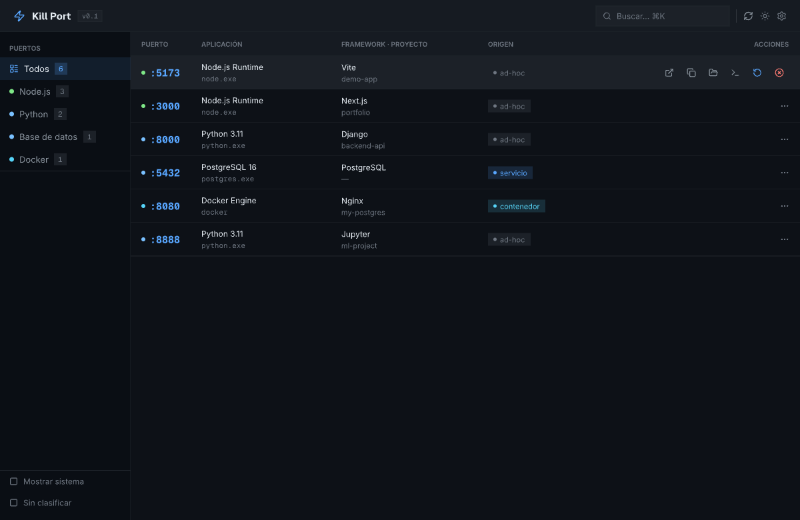
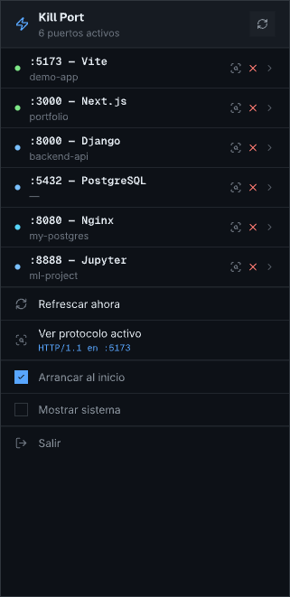

# Killport

<div align="center">


&nbsp;&nbsp;


**Kill the process on any port — and know exactly what you're hitting.**

[](https://github.com/episuarez/killport/actions)
[](https://github.com/episuarez/killport/releases)
[](LICENSE)
[](https://github.com/episuarez/killport/releases)
[](https://www.rust-lang.org)

</div>

---

## Install

Download the latest `.exe` installer or `.msi` package from the [Releases](https://github.com/episuarez/killport/releases) page.

Requires **Windows 10 version 1803** or later (WebView2 runtime, included with Windows since 2018).

---

## What it does

| Feature | Details |
|---|---|
| **Port scan** | All listening TCP ports, IPv4 + IPv6, via Win32 IP Helper API — no `netstat` |
| **Process context** | Runtime (Node, Python, PHP, Go, PostgreSQL, Redis, Docker…) + detected framework (Vite, Next.js, Django, Laravel…) + project name |
| **Docker-aware** | Maps container ports to their image and name |
| **Windows services** | Identifies SCM-registered services |
| **Kill** | Graceful (WM\_CLOSE → wait → force) or immediate; kills entire process trees |
| **Restart** | Kills and respawns with the original command line and working directory |
| **System tray** | Popup port list, notifications on port open/close, reserved-port alerts |
| **Dashboard** | Protocol probe (HTTP/WS/Redis/MySQL/gRPC…), QR code for mobile access |
| **CLI** | Headless `killport` binary for scripting and automation |

---

## CLI usage

```
killport list                  # dev ports only
killport list --all            # include system processes
killport kill <port>           # graceful kill
killport kill <port> --force   # immediate kill
killport kill --pid <pid>      # kill by PID
killport restart <port>        # kill + respawn
```

---

## Build from source

```bat
rustup update stable
cargo install tauri-cli

git clone https://github.com/episuarez/killport
cd killport

cargo tauri build              # desktop app + installer
cargo build -p killport-cli --release   # CLI only
```

Binaries land in `target/release/`.

---

## Contributing

See [CONTRIBUTING.md](CONTRIBUTING.md) for setup, commit conventions, and the release process.

---

## License

MIT — see [LICENSE](LICENSE).
